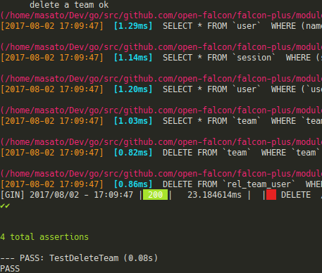

## api模组测试机制

此api测试使用的是 [goconvey](https://github.com/smartystreets/goconvey) 作為测试框架, 它可以相容于一般的`go test `机制

因為api测试比较特别, 有一些需要整合测试资料以及gin框架的middleware. 所以这裡的测试主要还是以api个别作整合测试為主轴.

#### 测试程序撰写说明:

1. 可以参照 `./uic` 下面的测试范例实作, `run_test.sh`作為控制该scope下所有测试的进入点.
裡面每一个测试都可以个别执行. `[ "$1" == "create" ]` 作為判断要不要跑创建的测试, 作為个别处理主要是因為建立為一次性测试, 除非将资料库还原清空要不然第二次以后的测试都不会通过.

2. 為了方便撰写测试, 在`api/test_utils` 裡面撰写了一些辅助测试功能. 如果想要了解或是做个别客制可以到这个文件夹看看.

3. 测试使用的资料库, 需要预先载入一些测试资料
  * 测试资料放置位置 `test_utils/sqltestset`
    * 如果需要增加新的测试资料请依照`t?_ooo.sql`去编号命名, 如果资料建立有先后顺序关系, 请调整t之后的数字排序. 可以辅助判断资料建立的顺序
  * 资料库的建立:
    * 你可建立一个空的资料库, 并手动执行过所有open-faclon需要资料的db patch. 然后运行 `cd test_utils/sqltestset && ./import_test_data.sh`
    * 另外一个比较简易的办法是建立测试的docker-image, `cd #{falcon_plus}/docker && docker-compose -f init.yml up -d mysqltest `
  * 需要注意的是预设测试使用的资料库port 為 `3307`
4. 测试时会使用api模组资料夹下的`test_cfg`作為测试设置档. 可以依需求修改此设置档.
5. 如何执行测试
  * 带有创建资料的测试
    * sh run_test.sh create
  * sh run_test.sh
  * 执行个别的测试案例
    * go test -v team_info_test.go -test.run TestTeamGetInfo

